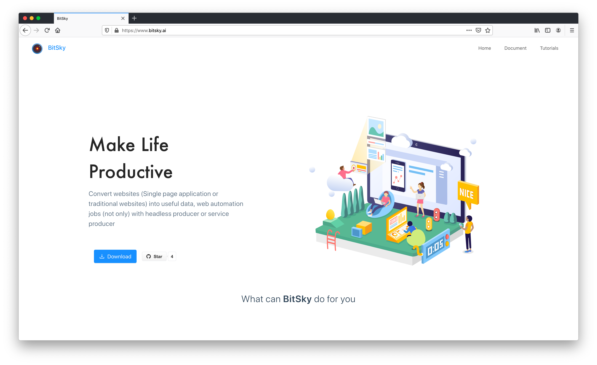
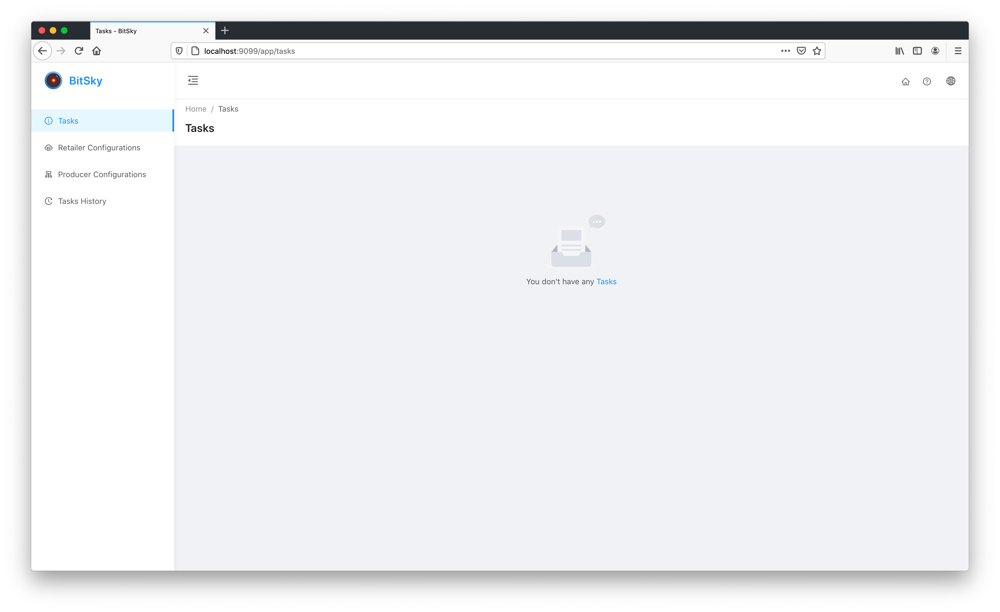
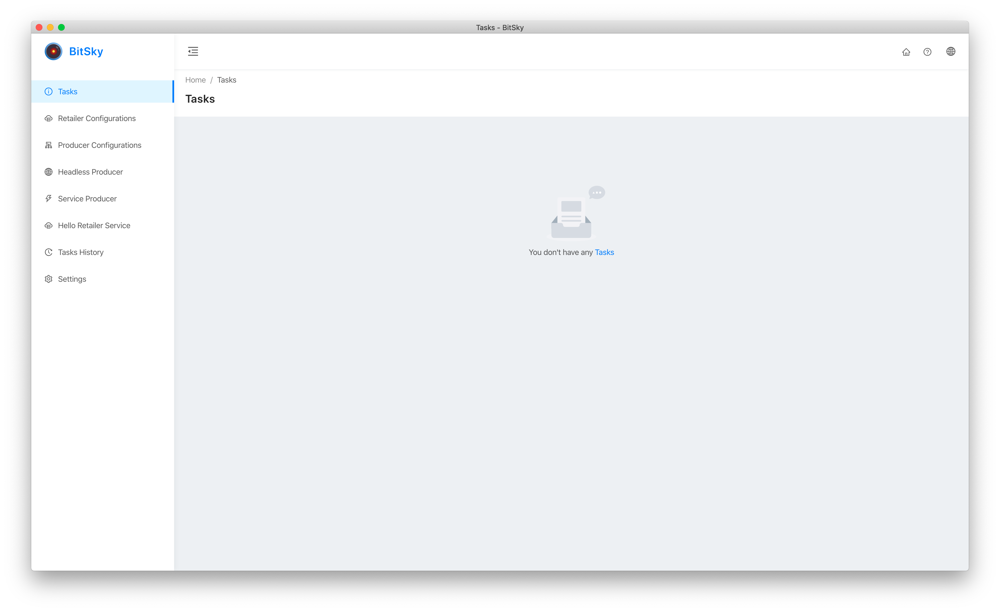

# BitSky Builder

## Available Build Scripts
Following are the avaible build scripts. 

### Build BitSky Official Website


```bash
npm run build-landing
```
Build latest landing application to `bitskyai.github.io` folder

### Build BitSky Web Application


```bash
npm run build-web-app
```
Build latest web application to `bitsky-web-app` folder, and by default start web app, you can view it - [http://localhost:9099](http://localhost:9099).

If you don't want to start application, then you can do this:
```bash
export NOT_START_SERVER=true && npm run build-web-app
```

If you don't want to intall `node_modules`, then you can do this:
```bash
export NOT_INSTALL_NODE_MODULES=true && npm run build-web-app
```

### Build BitSky Desktop Application


```bash
npm run build-desktop-app
```
Build latest desktop application inside `bitsky-desktop-app/out`

### Copy BitSky Web Application to Desktop Application
During develop time, after you change `bitsky-ui` or `bitsky-supplier`, if you want to test it inside Desktop Application, you need to run this command to copy latest changes to `bitsky-desktop-app`. After executed successfully, then you need can run `npm start` inside `bitsky-desktop-app` to see latest changes.

```bash
npm run copy-web-app-to-desktop-app
```

### Build docker images
#### Build `bitskyai/headless-producer` and `bitskyai/service-producer` docker image:
```bash
npm run build-docker-service-producer
```

```bash
npm run build-docker-headless-producer
```

#### Build `bitskyai/web-app` docker image:
```bash
npm run build-docker-web-app
```

If you want to get latest UI, run first:
```
npm run build-web-app
```
